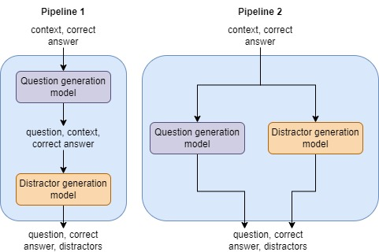
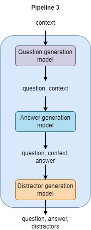

# NLP-project


## Project Description
This project is a part of the course "Natural Language Processing" at the University of Groningen.
AI tools can be a valuable resource to build education resources. 
Among those, a very popular testing method uses quizzes or flashcards to test students' understanding of the information they are taught. 
This project aims to design a system that can generate multiple-choice questions, answers, and possible choices/distractors for a given paragraph of text. 
Importantly, the way in which questions are formulated, and the given choices can significantly influence the quiz difficulty. 
Our system will be able to generate questions-answers pairs and three alternatives, called distractors, for a given paragraph of text.

For this project, we built the following pipelines using a mix of existing and fine-tuned models:




## Installation
The packages can be installed using requirements.txt file. The University of Groningen owns a cluster, called Habrok.
The repository contains a shell script to initialize the virtual environment and install the required packages, called ``init.sh``.
Then a job can be submitted with the ``job.sh``.

## Dataset
The dataset used for this project is  SciQ dataset which contains Question-Answer pairs along with three alternatives (also called distractors) and a context/support. 
The questions in this dataset originate from the fields of Physics, Chemistry and Biology, among others. 

## Models
The model classes can be found in the `models` folder. The models are divided into three categories: question generation, answer generation, and distractor generation.
They use enums to define the type of model and the model name, which can be found in the `/utils/enums.py` file.

### Question generation models
The models we trained can be found on the HuggingFace model hub. 
The links to the models are as follows: [Link](https://huggingface.co/kxv26).
We fine-tuned the following question generation models:
- [questions-1, Fiona](https://huggingface.co/kxv26/fiona): This model was trained using the Flan-T5 model with the base size. It takes as input a context.
- [questions-2, Leslie](https://huggingface.co/kxv26/leslie): This model was trained using the Flan-T5 model with the base size. It takes as input a context and a correct answer.

The trainer and its parameters can be found in the `utils` folder, called `trainer.py`.
We compared these models to the existing models [AllenAI](https://huggingface.co/allenai/t5-small-squad2-question-generation)
and [Potsawee](https://huggingface.co/potsawee/t5-large-generation-squad-QuestionAnswer). Their generation capabilities have been judged with appropriate metrics that can be found in `utils` folder, called `statistics.py`.
The evaluation of the models can be found in the `results_analysis.ipynb` notebook. The results we generated can be found in the `question_models_results` folder.

### Answer generation models
For the answer generation models, we compared the following models: [Deepset](https://huggingface.co/deepset/roberta-base-squad2), [Intel](https://huggingface.co/Intel/dynamic_tinybert), and
[Distilbert](https://huggingface.co/distilbert/distilbert-base-cased-distilled-squad).  Their generation capabilities have been judged with appropriate metrics that can be found in `utils` folder, called `statistics.py`.
The evaluation of the models can be found in the `results_analysis.ipynb` notebook. The results we generated can be found in the `answer_models_results` folder.

### Distractor generation models

For the distractor generation models, we fine-tuned the following models:
- [distractors-1, Pado](https://huggingface.co/kxv26/pado)
- [distractors-2, Saso](https://huggingface.co/kxv26/saso)
- [distractors-3, Zanos](https://huggingface.co/kxv26/zanos)
- [distractors-4, Kola](https://huggingface.co/kxv26/Kola)

And we compared these with the existing model [Potsawee](https://huggingface.co/potsawee/t5-large-generation-race-Distractor).
Their generation capabilities have been judged with appropriate metrics that can be found in `utils` folder, called `statistics.py`.
The evaluation of the models can be found in the `results_analysis.ipynb` notebook. The results we generated can be found in the `distractor_models_results` folder.

## Pipelines
The pipelines can be found in the `pipelines.py` file in the `models` directory.
For this, we constructed a base model in the `base_model.py` file that combines and coordinates the inputs and the generation models.
The base model is then used in the pipelines to generate questions, answers, and distractors. The pipelines contain the best performing models, determined by our evaluation.
We compared the generation capabilities of the pipelines, when using the different models in one system. We computed the metrics in the `utils` folder, called `statistics.py`.
The comparison of the pipelines can be found in the `results_pipelines.ipynb` notebook. 

## Main
In the `main.py` file, we provided different modes that can be invoked with:
```bash
python main.py <mode>
```
The following modes are available:
- regular: runs the regular pipeline
- interactive: runs with UI (using Gradio)
- train_q: trains the question models
- train_d: trains the distractor models
- evaluate: evaluates the question generation, answer generation and distractor generation models.
